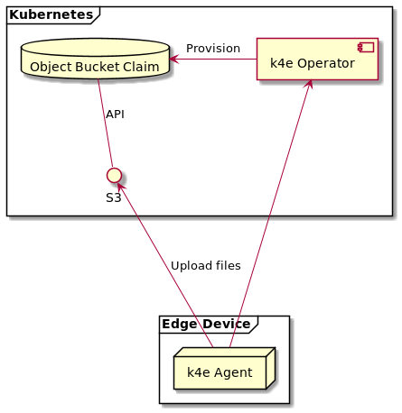

# Data Upload

## Design
K4e agent and Operator provide functionality of uploading contents of on-device directories to control-plane object storage.
The architecture of that solution is depicted by the diagram below.



### Object Bucket Claim

The objects uploaded from the edge device are stored in a device-dedicated Object Bucket Claim. Object Bucket Claim is provisioned 
when a device is registered with the cluster. The OBC is created in the same namespace and with the same name as `EdgeDevice` it's created for.

### S3
The Object Bucket Claim is exposed with S3 API and can be accessed with any client that supports that protocol (i.e. AWS S3 CLI and libraries).

Information needed to access the Bucket using S3 API is stored in following resources in the same namespace as the OBC (and `EdgeDevice`):

* `ConfigMap` with the same name as the OBC contains the Bucket name and in-cluster service endpoint address;
* `Secret` with the same name as the OBC contains `AWS_ACCESS_KEY_ID` and `AWS_SECRET_ACCESS_KEY`.

### Get configuration

The k4e agent periodically downloads configuration from the k4e operator and part of that configuration is data paths mapping for data upload - specified in each `EdgeDeployment`:
```yaml
spec:
  data: 
    paths:
      - source: source/path/1    
        target: target/path/1
      - source: source/path/2
        target: target/path/2
```

Each `path` specifies which on-device directory (`source`) should be synchronized to which control-plane directory (`target`). 
`source` directory is always a subdirectory of a "well-known" `/export` directory in every container running on the device.

The `/export` directory is shared among containers of one workload (pod), but different workloads (pods) have them separate; each workload has `/export` directory backed by different host path volume. It is added automatically and should not be part of the `EdgeDeployment`.

The device configuration provided by the k4e operator also contains S3 connection details (endpoint URL, bucket name, keys) that point to a device-dedicated in-cluster bucket.

#### Example

EdgeDeployment:
```yaml
apiVersion: management.k4e.io/v1alpha1
kind: EdgeDeployment
metadata:
  name: os-stats
spec:
  deviceSelector:
    matchLabels:
      dc: home
  data:
    paths:
      - source: stats
        target: statistics
  type: pod
  pod:
    spec:
      containers:
        - name: stats-collector
          image: quay.io/jdzon/os-stats:v1
```

Pod specification used to run the workload (generated):
```yaml
kind: Pod
metadata:
  creationTimestamp: null
  name: os-stats
spec:
  containers:
  - image: quay.io/jdzon/os-stats:v1
    name: stats-collector
    resources: {}
    volumeMounts:
    - mountPath: /export
      name: export-os-stats
  volumes:
  - hostPath:
      path: /var/local/yggdrasil/device/volumes/os-stats
      type: DirectoryOrCreate
    name: export-os-stats```
```

In this case on-device `/export/stats` directory will be synced to a `statistics` subdirectory of a device-dedicated bucket.

### Upload files

The k4e agent synchronizes paths specified in the configuration every 15 seconds. Only new or changed files are transferred. 

Files removed on the device are not removed from the control plane storage.