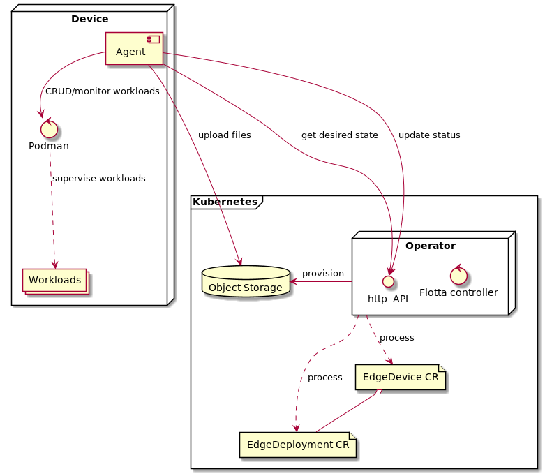
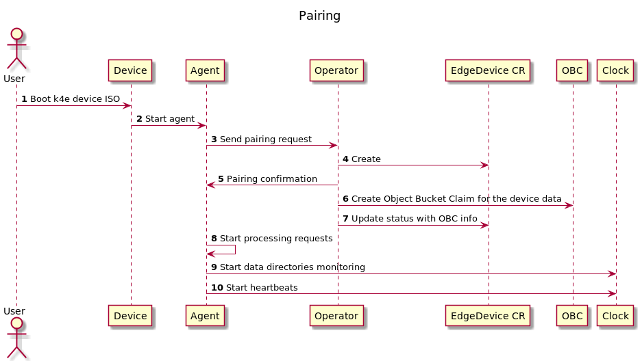

# Design

## Architecture

### Control plane - Kubernetes

#### Operator

The k4e operator is a Kubernetes operator that consists of two components:
 - controller responsible for reconciling `EdgeDevice` and `EdgeDeployment` CRs;
 - HTTP API that is used by the k4e agent to get expected configuration and to post heartbeat messages. See [HTTP API schema](http-api.md) for more details.

#### Object Storage

Object Storage is used to store files created by workloads on devices and uploaded using k4e built-in mechanism.

Object Bucket Claims provided by OCS and Noobaa and accessible with like S3 buckets. 

See [Data Upload](data-upload.md) for more details.

#### CRDs

Operator manages two kinds of CRs: 
 - `EdgeDevice` representing physical edge devices; see [the definition](../../config/crd/bases/management.k4e.io_edgedevices.yaml) or [an example](../../config/samples/management_v1alpha1_edgedevice.yaml)
 - `EdgeDeployment` representing workloads that can be scheduled to run on edge devices; see [the definition](../../config/crd/bases/management.k4e.io_edgedeployments.yaml) or [an example](../../config/samples/management_v1alpha1_edgedeployment.yaml)

See [Custom Resource Definitions](crds.md) for more details.

### Edge Devices

#### Agent

Agent is running constantly on the edge device and responsible for:
 - getting expected device configuration specification from the control plane;
 - making the device's actual state to reflect configuration specified by the control plane;
   - re-configuring agent internal settings;
   - starting, removing and monitoring workloads - pods; 
 - posting device's status to control plane using heartbeat messages;
 - uploading workload-generated files to control plane Object Storage (see [Data Upload](data-upload.md)).

Agent is running in two processes:
 - [yggdrasil](https://github.com/jakub-dzon/yggdrasil/) - gateway service responsible for communication with the control plane; dispatches messages to and from the control plane from/to workers (extensions);
 - [device-worker](https://github.com/jakub-dzon/k4e-device-worker) - yggdrasil worker responsible for performing all the logic listed above.

## Workflows

### Device registration/pairing

 1. User boots the edge device with k4e device ISO
 2. Agent service is started by systemd
 3. Agent sends pairing/registration request containing device's hardware information to the control plane (Operator's HTTP endpoint) 
 4. Operator creates `EdgeDevice` resource representing the registering device
 5. Agent registration is concluded
 6. Operator creates `ObjectBucketClaim` for storing data uploaded from the device
 7. Operator updates `EdgeDevice` status sub-resource with the name of newly created `ObjectBucketClaim`
 8. Agent starts processing requests (downloading configuration)
 9. Agent schedules workload data directories monitoring
 10. Agent schedules periodical heartbeat messages

### Worklad deployment workflow

 1. User creates `WorkloadDeployment` resource
 2. Operator process `WorkloadDeployment` resource and finds matching `EdgeDevices`
 3. Operator adds `WorkloadDeployment` reference to all matching `EdgeDevices`
 4. New workload configuration is included in configuration downloaded by the agent
 5. Deployment status in `EdgeDevice` status sub-resource is set to "Deploying"
 6. Agent opens host ports listed in the pod specification
 7. Agent starts the pod on the device using podman play kube
 8. New workload status is included in periodically sent heartbeat messages
 9. The workload status in `EdgeDevice` status sub-resource is updated